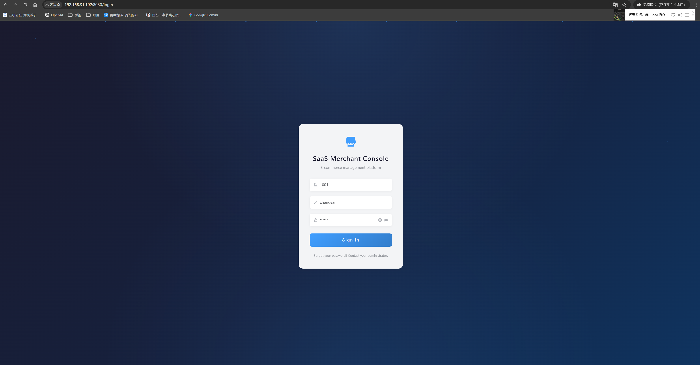
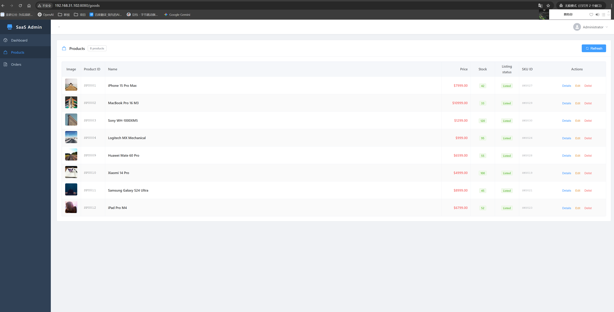
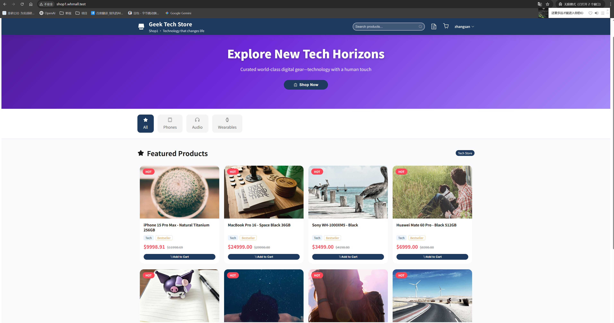
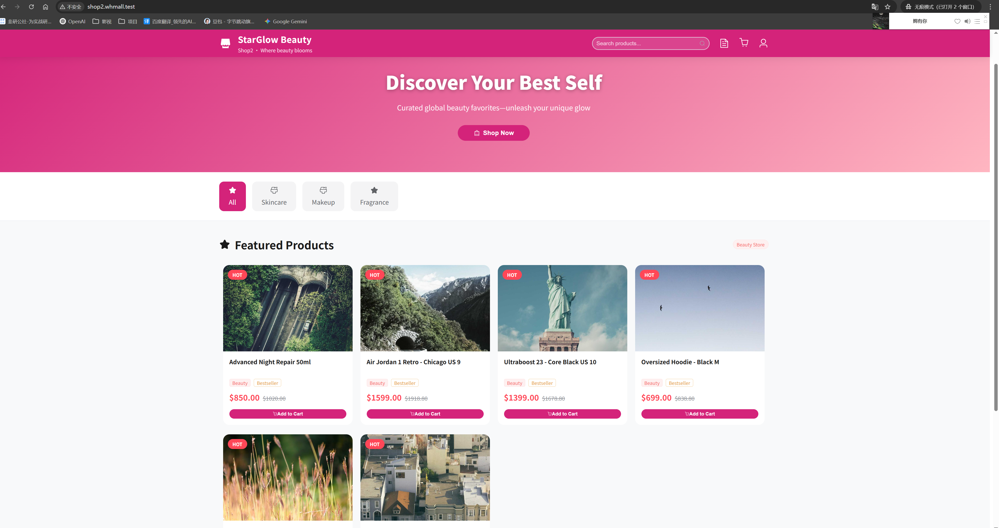
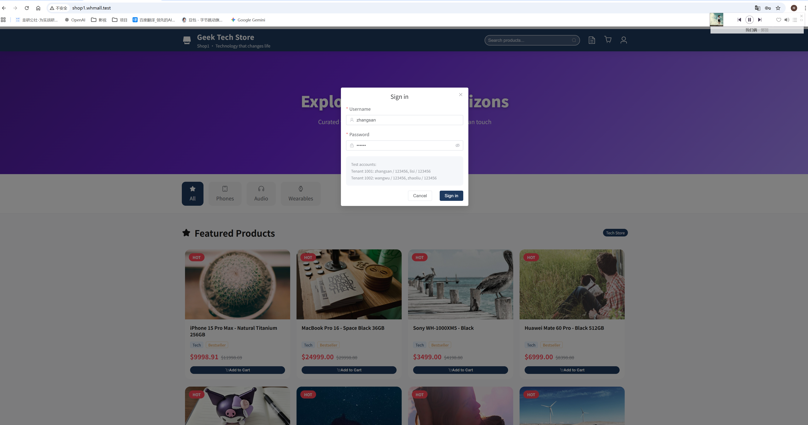
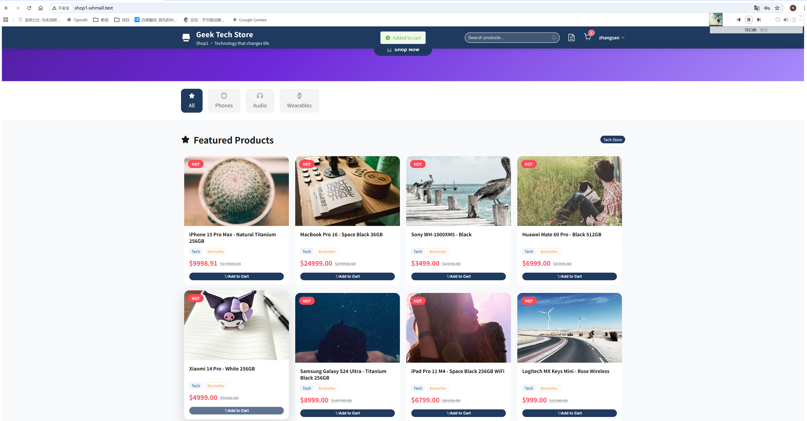
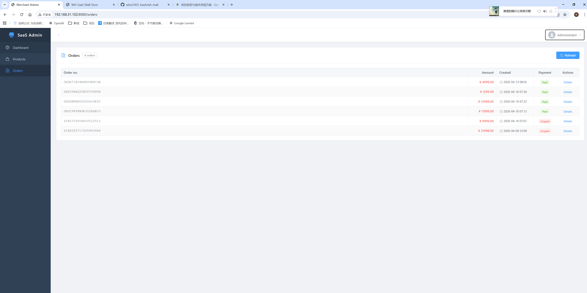
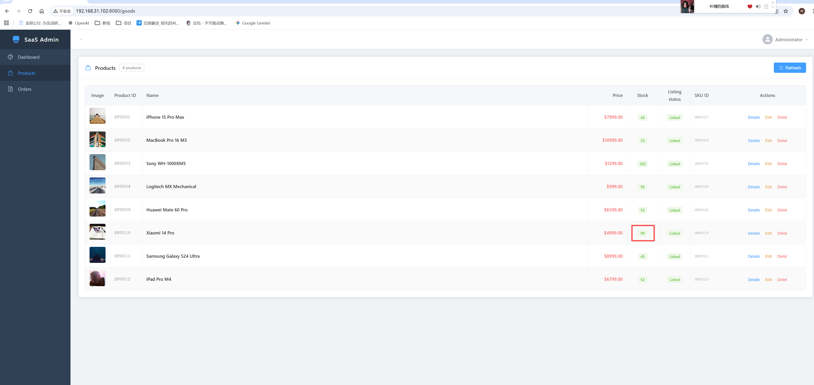

# 企业级 SaaS 多租户电商基础设施底座 (防超卖/极速开店版)

### 🚀 商业价值：“让您的连锁业务在几天内上线，而不是几个月”
本项目提供了一个**生产级可用、基于微服务架构的 SaaS 底座**。它专为需要通过单一中心化后台管理多个门店、子品牌或加盟商的企业设计，在保障数据绝对安全和交易完整性的前提下，实现业务的极致扩张。

---

### 🎯 解决的核心商业痛点

#### 1. “大促/秒杀”带来的超卖噩梦 (不超卖承诺)
* **解决方案**：底层集成了**分布式锁机制**与**异步支付回调状态机**。即使在高并发环境下，系统也能保证库存扣减的 100% 精准，彻底杜绝超卖。

#### 2. 业务扩张成本高、速度慢 (极速开店)
* **解决方案**：**真正的多租户架构**。通过“配置即开店”逻辑，一套后端支撑无限门店，让新店最快只需 **72 小时** 即可上线。

#### 3. 加盟商的数据安全焦虑
* **解决方案**：**物理级数据隔离**。确保租户 A 绝对无法越权访问租户 B 的数据，保障商业机密。

---

### 📸 系统演示与操作预览

#### 1. 中心化管理后台 (控制中心)
通过统一的门户管理所有租户、商品分类及系统全局配置。
|  |  |
|:---:|:---:|
| *商品与分类管理* | *租户系统配置* |

#### 2. 数字化门店 (用户端体验)
简洁、现代且适配移动端的界面设计，旨在将访问者转化为购买者。
|  |  |
|:---:|:---:|
| *门店首页展示* | *商品详情页* |

#### 3. 订单与库存全生命周期
对每一笔交易进行全链路追踪，并实现实时的库存同步。
|  |  |
|:---:|:---:|
| *订单列表概览* | *履约状态追踪* |
|  |  |
---

### 💻 核心技术架构亮点
* **微服务生态**：基于 **Spring Cloud Alibaba**（Nacos, Gateway, Sentinel）构建。
* **性能巅峰**：利用 **Redis** 支撑高频缓存，**RocketMQ** 实现系统解耦与削峰填谷。
* **云原生支持**：全套 **Docker** 容器化方案，完美适配 **Kubernetes (K8s)** 集群。

---

### 🛠 技术栈
* **后端**：Java 17, Spring Boot 3, Spring Cloud Alibaba
* **数据库**：MySQL (MyBatis Plus)
* **中间件**：Redis, RocketMQ, Nacos
* **运维**：Docker, Docker-Compose, Nginx

---

### 📩 联系与合作
我长期承接全球范围内的后端架构外包与技术咨询。

* **邮箱**: [whui3425@gmail.com](mailto:whui3425@gmail.com)
* **Upwork**: [您的个人主页链接]

**让我们将您的技术挑战转化为市场竞争优势。**